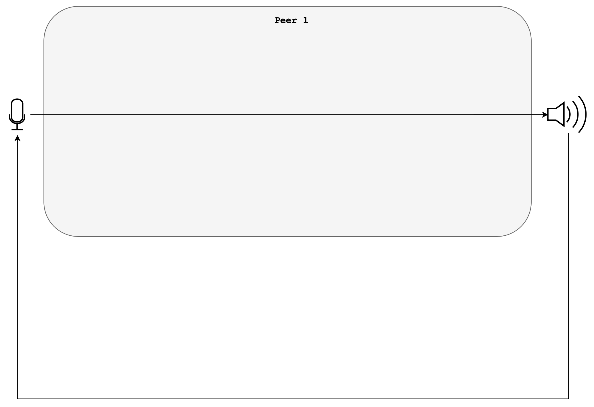
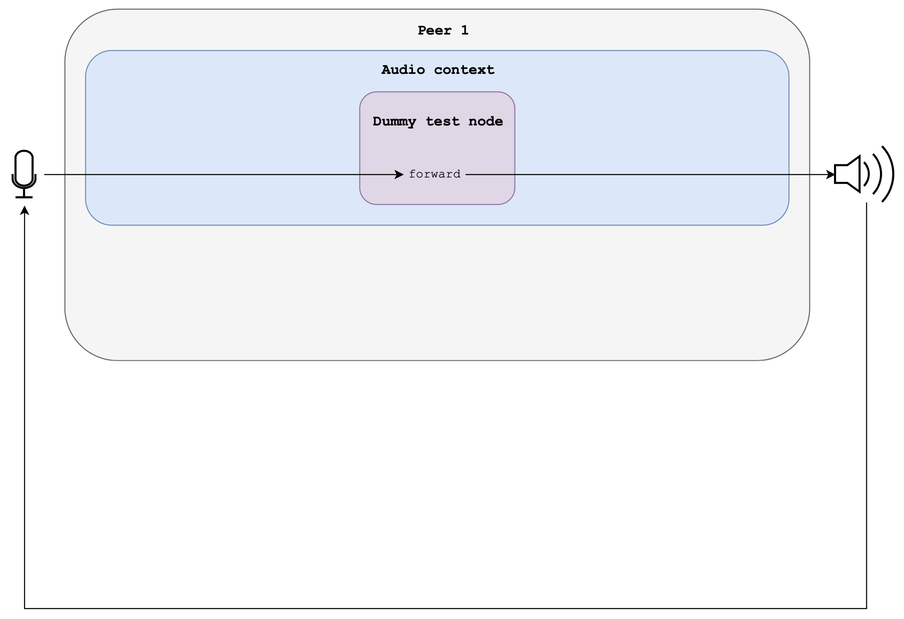
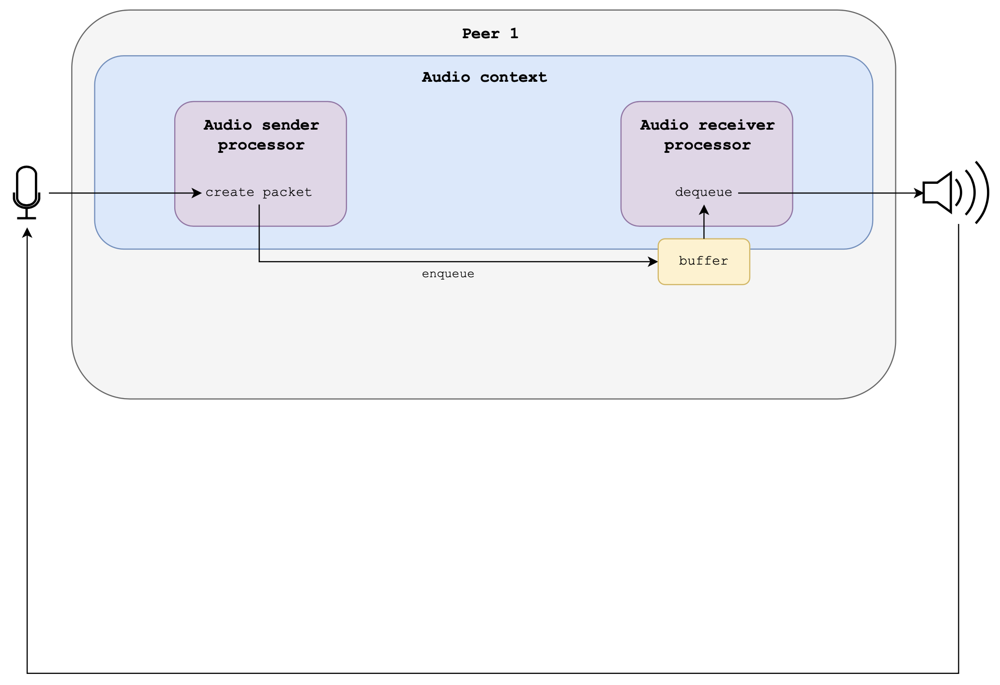
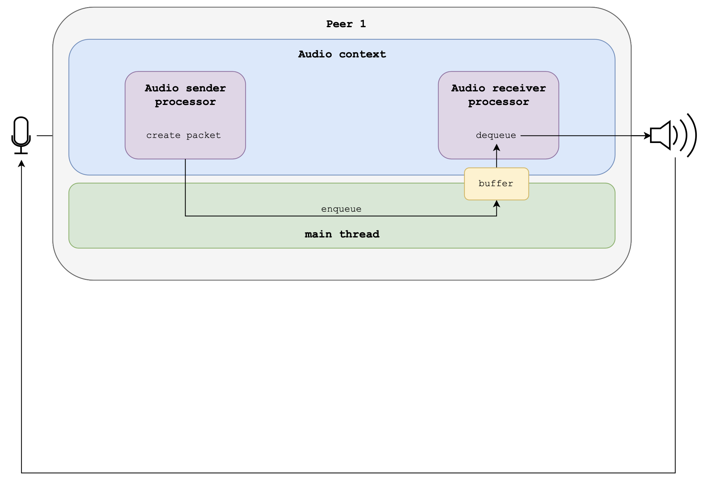
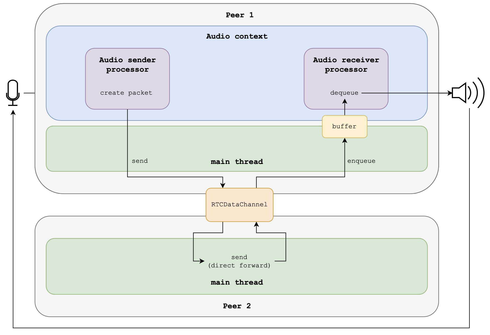

# Guide for testing

**Author:** Gastaldi Paolo

## Index of contents

- [Install dependencies](#install-dependencies)
- [Start the server](#start-the-server)
- [Configure the client](#configure-the-client)
    + [Options list](#options-list)
- [Loopback modes](#loopback-modes)
    + [Loopback 1 - directForwardLoopback](#loopback-1-\--directforwardloopback)
    + [Loopback 2 - basicForwardLoopback](#loopback-2-\--basicforwardloopback)
    + [Loopback 3 - localLoopback](#loopback-3-\--localloopback)
    + [Loopback 4 - fullLocalLoopback](#loopback-4-\--fulllocalloopback)
    + [Loopback 5 - networkLoopback](#loopback-5-\--networkloopback)

## Install dependencies

Run the dependencies script:

```bash
./dependencies.sh
```

## Start the server

Run the server:

```bash
./run.sh
```

## Configure the client

Run the configuration manager:

```bash
./configure.sh [OPTIONS...]
```

### Options list:
- `-h, --help`: show help
- `-l, --log`: enable logs on console. WARNING: logs can have effects on app performances. _Default: disabled_
- `-i, --input <channels>`: set the number of input channels. _Default: 1_
- `-o, --output <channels>`: set the number of output channels. _Default: 1_
- `-b, --buffer <offset>`: set the dejitter buffer offset: _Default: 8_
- `-j, --jitter`: track jitter and enable graph button on GUI. Default: disabled
- `-1, --loopback1`: use directForwardLoopback between mic and speaker, no other threads 
- `-2, --loopback2`: use basicForwardLoopback between with the audio thread 
- `-3, --loopback3`: use localLoopback with audio processors
- `-4, --loopback4`: use fulllocalLoopback with thread exchange 
- `-5, --loopback5`: use networkLoopback between 2 application 
- `-m, --messagechannel`: use message channel 
- `-s, --sab`: use shared array buffer 
- `-w, --waitasync`: use wait async

> **Note:** no server restart is required. But you have to refresh the webpage

## Looback modes

### Loopback 1 - directForwardLoopback

```Javascript
AudioChain = {
    input,
    // No AudioNode is created
    audioContext.destination
}
```



### Loopback 2 - basicForwardLoopback

```Javascript
AudioChain = {
    input,
    dummyTestNode, // Forward audio from input to output
    audioContext.destination
}
```




### Loopback 3 - localLoopback

```Javascript
AudioChain = {
    input,
    sender, // Insert directly in the receiving queue
    receiver,
    audioContext.destination
}
```




### Loopback 4 - fullLocalLoopback

```Javascript
AudioChain = {
    input,
    sender, // Send data to the main thread
    // The main thread insert data directly in the receiving queue
    // WebRTC is not used
    receiver,
    audioContext.destination
}
```




### Loopback 5 - networkLoopback

```Javascript
AudioChain = {
    input,
    sender, // Send data to Peer2
    // Peer2 receives data and sends them back to Peer1
    // IMPORTANT: Peer2 MUST have the loopback button enabled (the one with an arrow)
    // Peer1 receives data and insert them in the receiving queue
    receiver,
    audioContext.destination
}
```




> **Note:** 2 applications are required for this loopback mode. They can be running on 1 or 2 PCs, these are different test cases